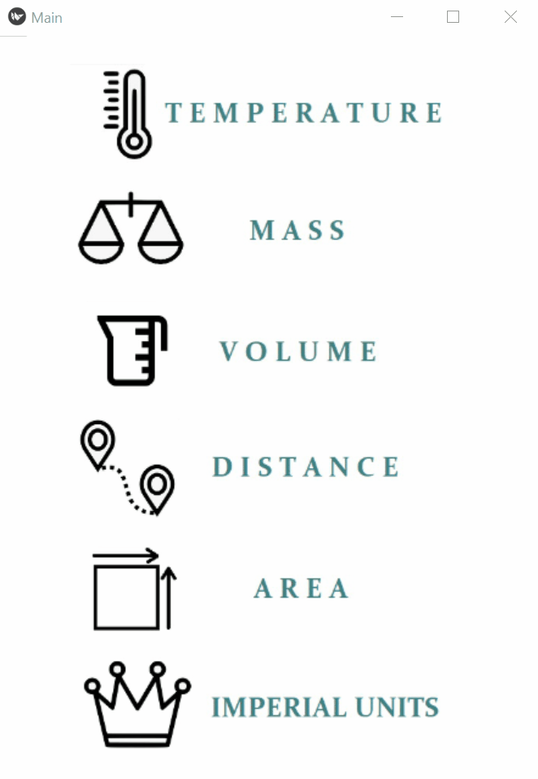

## Canadian Converter app
(kivy)

A mobile app converting metric units to imperial units and vice versa
for everyday use. The idea came to me as I am moving to Canada beginning of 2021!

Main screen has buttons which on click 'open' the area with text inputs. 
Clicking another button 'closes' the area and 'opens' a new one.
The last button "imperial units" opens a new screen for converting between imperial units.

The APK file available (for Android).  
 
 What the app can convert:
* temperature 
    * F° vs C°
* mass 
    * ounce vs gram
    * pound vs kg
* volume 
    * fluid ounce vs ml
    * quart vs litre
    * gallon vs litre
* distance
    * inch vs mm
    * foot vs cm
    * yard vs metre
    * mile vs km
* area
    * square feet vs square metres
    * square yards vs square metres
    * acre vs hectare
    * square mile vs square km
* conversion between imperial units
    * ounce vs pound
    * fluid ounce vs quart vs gallon
    * inch vs foot vs yard
    * square feet vs square yards

